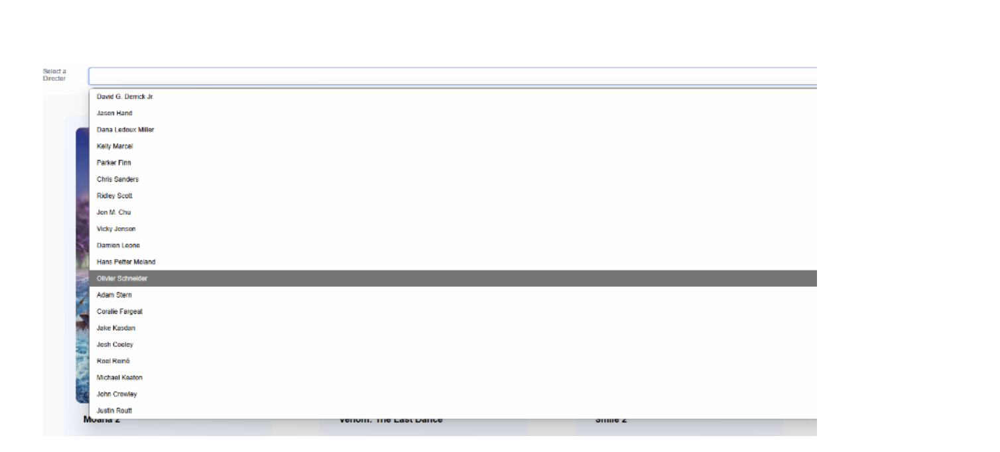
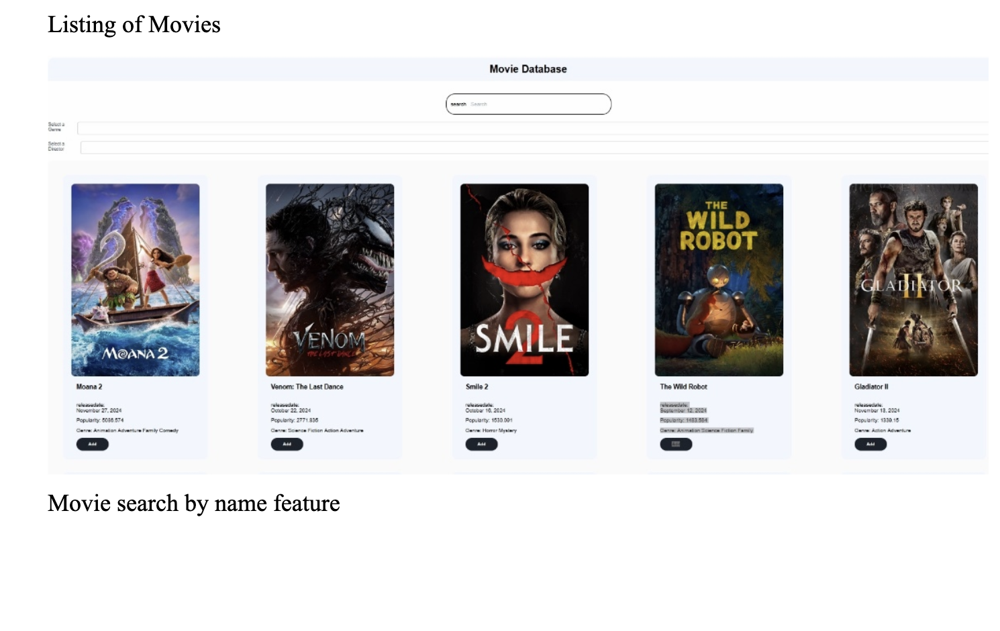
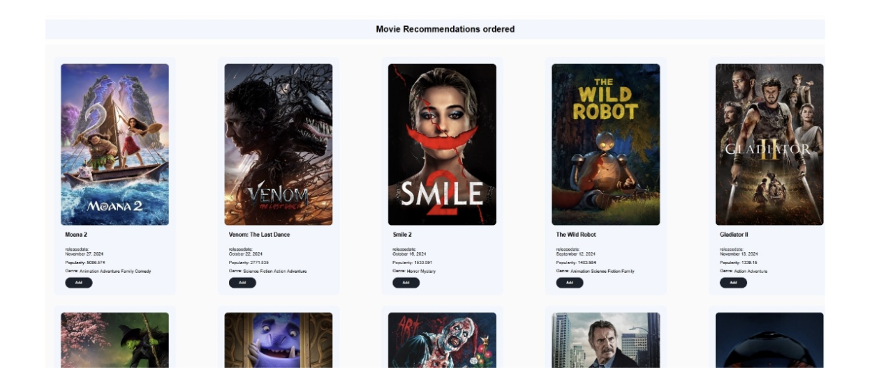
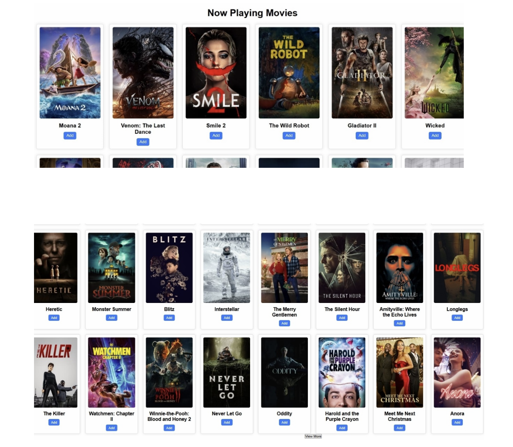
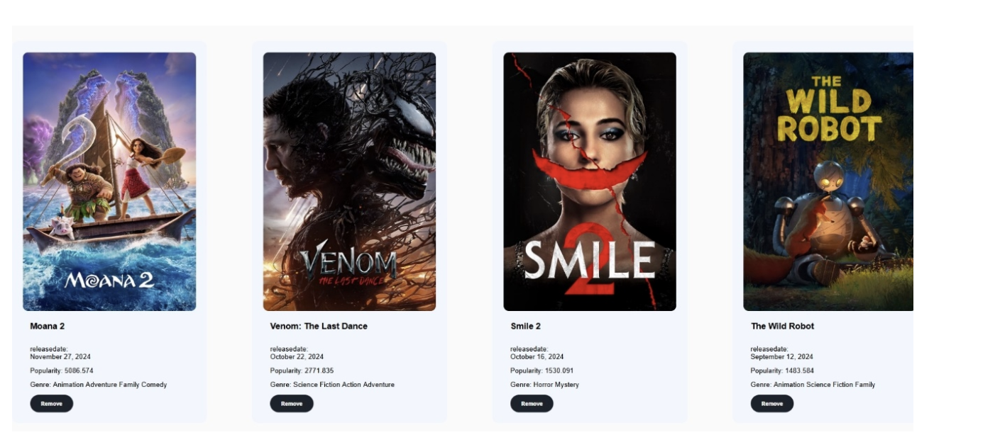

# DB_Movie
The repository will be used to facilate and curate the development of the Movie database Final Project

# Movie Database Project

## Introduction

With the ever-growing world of films, discovering movies that match personal preferences can feel overwhelming. Movie critics, from experienced moviegoers to casual viewers, often struggle to find accurate, interactive, and user-friendly platforms to explore films. This project aims to bridge that gap by developing an interactive and detailed movie database. Leveraging the TMDb API, the platform offers rich features such as genres, cast, crew, release dates, and reviews.

Designed with the PERN stack (PostgreSQL, Express.js, React, Node.js), this application provides users with seamless searching, sorting, and filtering capabilities. The goal is to create a centralized movie discovery platform that offers an engaging, personalized browsing experience, enhancing film-related exploration.

---

## Design

### Technology Stack:
- **Frontend**: React, HTML, CSS
  - Dynamic, responsive interface
  - Personalized recommendations for a user-friendly experience
- **Backend**: Node.js, Express.js
  - Efficient server-side operations
  - Real-time updates for smooth user experience
- **Database**: PostgreSQL
  - Robust relational data handling for structured movie data
  - Supports genres, cast, crew, and user ratings

These technologies ensure seamless integration and scalability for advanced movie discovery features.

---

## Implementation

### Tools and Technologies:
- **Frontend**: HTML, CSS, React
- **API Integration**: TMDb API for fetching movie data (genres, cast, crew)
- **Backend**: Node.js, Express.js for server-side operations
- **Database**: PostgreSQL for relational data management, pgAdmin for database configuration
- **Testing**: Postman for API validation
- **Development**: VS Code for efficient coding, debugging, and collaboration

---

## Functionality

### User Features:
1. **Sign-Up and Login**:
   - Sign up to create personalized accounts
   - Access recommended movies, reviews, and ratings
   
2. **Search Movies**:
   - Search by name or director
   
   - Filter by genre
   
   - Search by Title
   
3. **Reviews and Ratings**:
   - Add and view reviews for movies
   
   - Rate movies on a scale of 1 to 5
   
4. **Recommended Movies**:
   - Personalized suggestions based on ratings and popular trends
   

### Admin Features:
1. **Add New Movies**:
   - Access admin portal: `/admin/signup` and `/admin/login`
   - Add movies to the collection using the TMDb API
   
2. **Delete Movies**:
   - Remove movies from the database via the admin interface
   

---

## User Manual

### For Users:
1. **Sign Up**:
   - Navigate to the homepage and click the **Sign Up** button.
   - Fill out the form with your name, email, and password.
   - Submit to create an account.
2. **Login**:
   - On the homepage, click **Login**.
   - Enter your email and password, then click **Login**.

3. **Search Movies**:
   - Use the search bar to find movies by name or director.
   - Results will display relevant details (title, director, release date, etc.).

4. **Create Reviews and Rate Movies**:
   - Navigate to a movie page.
   - Add a review by entering text in the review box.
   - Rate the movie by selecting a score from 1 to 5.

5. **View Recommended Movies**:
   - Access the **Recommended Movies** section for suggestions.

### For Admins:
1. **Sign Up and Login**:
   - Access the admin portal via `/admin/signup` and `/admin/login`.
2. **Add Movies**:
   - Use the admin dashboard to add movies to the collection.
3. **Delete Movies**:
   - Browse the movie listings and remove unwanted movies.

---

## Conclusion

This movie database application delivers a comprehensive solution for movie enthusiasts and casual fans alike. By integrating the PERN stack, TMDb API, and modern web tools, it offers a seamless platform for exploring, reviewing, and rating films. Features like personalized recommendations, advanced search options, and admin functionalities enhance user experience and accessibility.

The project highlights the power of modern web development to solve real-world challenges, simplifying how users interact with the cinematic world. It serves as a versatile tool for movie lovers, providing an engaging and efficient movie discovery experience.

---

## Group Members & Contributions:

- **Daniel Oluwarotimi**: Backend/Database Engineer, Meeting Coordinator
- **Dimitri Wesson**: Database Architect, Optimization
- **Donald Davis**: Software Tester, User Experience, UI Design
- **Janiya Rodriguez-Hunt**: Documentation, Quality assessment and Analysis
- **Michael Adeleke** – Front-End engineer, UI Design

## Demo and Resources

- **Movie Database Demo**: [Loom Video](https://www.loom.com/share/adb29f7994a842cc8cddb2af05b851ff?sid=828f219c-f96d-4c0d-b039-e59f389c8bb1)
- **Repository Explanation**: [YouTube Video](https://youtu.be/a2D9qwRtmr8)

